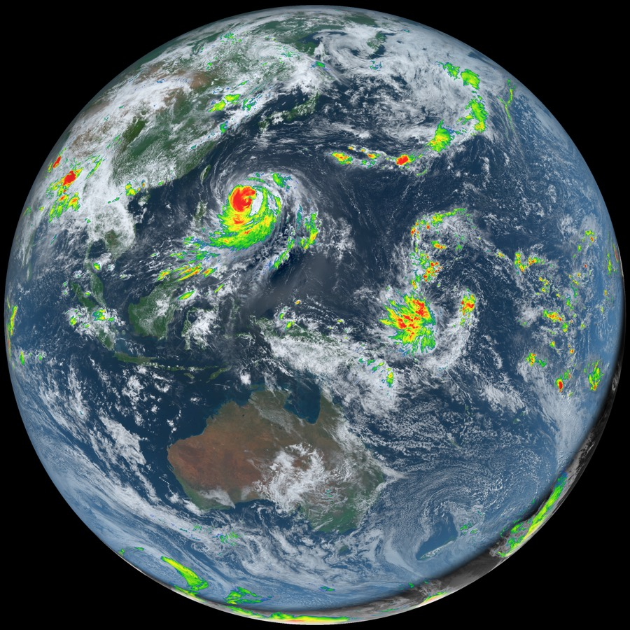
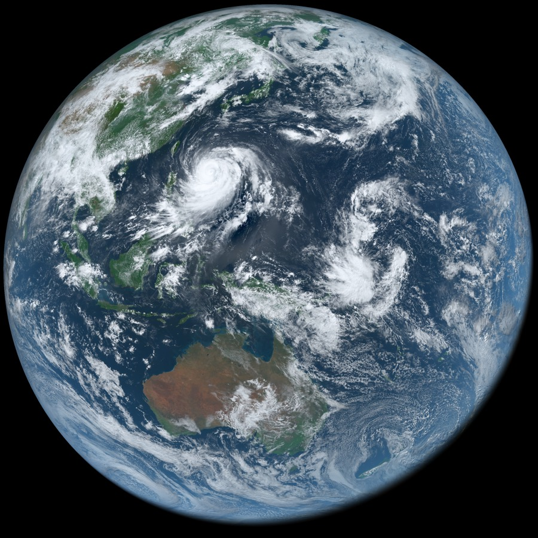
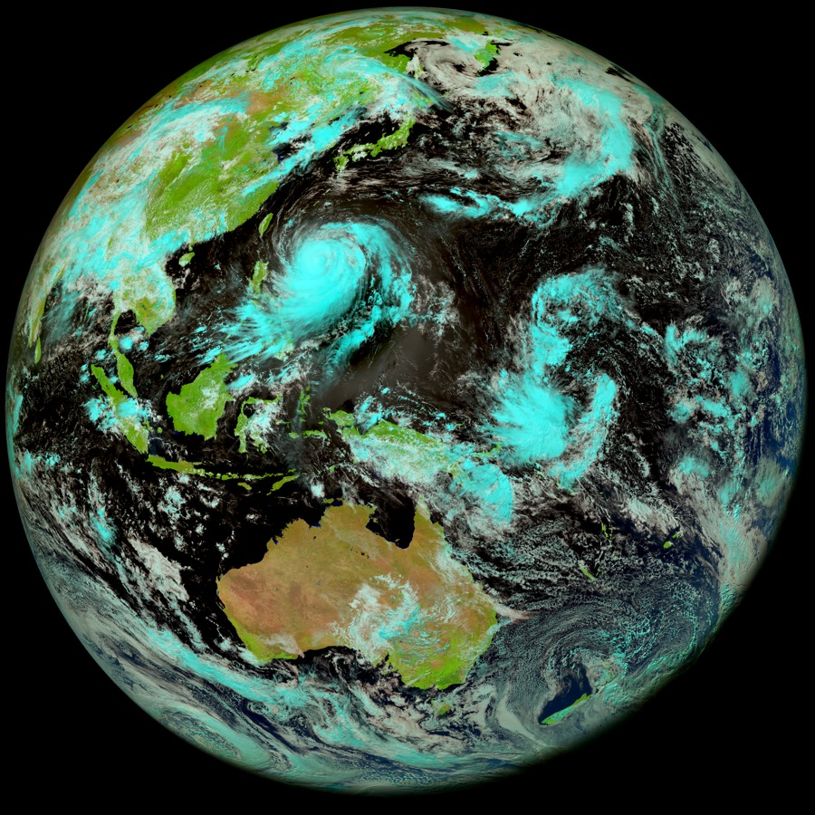
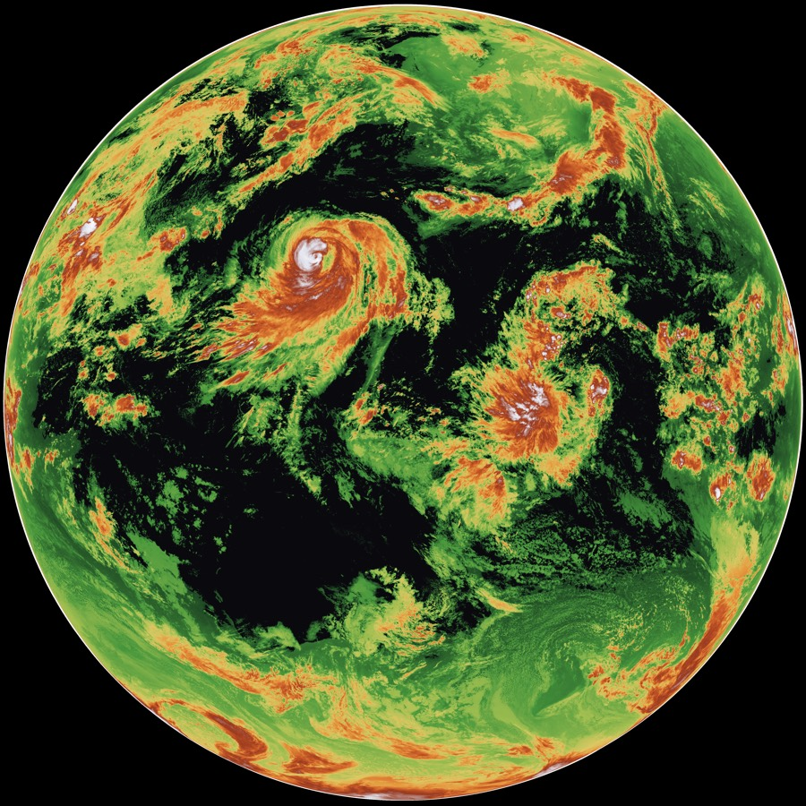
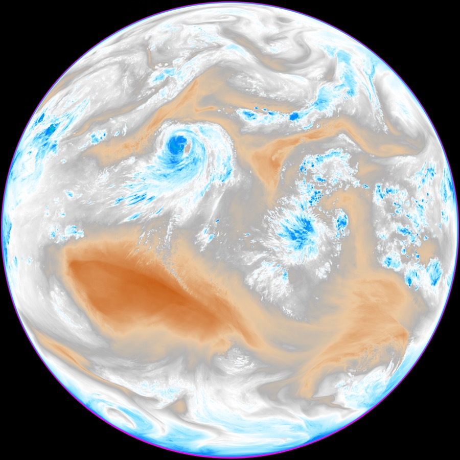
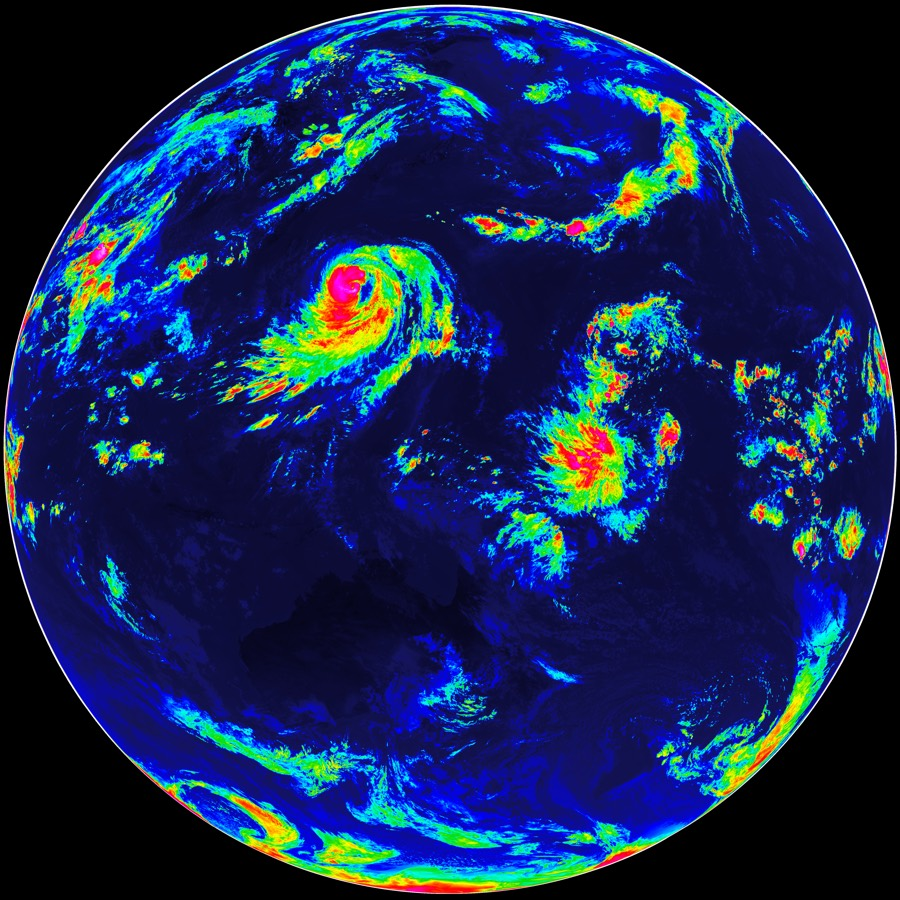

# himawari-renderer

**Render the latest files from the Himawari 9 geostationary satellite**

`himawari-renderer` downloads raw Level-1b data from the [Himawari-9](https://registry.opendata.aws/noaa-himawari/)
weather satellite (free, no account needed) and renders it into full-disk
imagery: true color, natural color, infrared enhancements, cloud-top
height, a combined day/night product, timelapse video, and a live
self-updating mode.

<p align="center">
  
</p>

## Features

- **True color** at the sensor's full 11000×11000 (1 km/pixel) resolution
- **Combined day/night product** — true color by day, infrared clouds by
  night, cold convective tops colorized in both (with parallax correction)
- **IR enhancements** for any thermal band, in four palettes
- **Natural color** (1.6 µm) — separates ice cloud from water cloud
- **Cloud-top height** rendered like a relief map
- **Timelapse video** with pipelined downloads (~2.5× faster than serial)
- **Watch mode** — a live Earth view that re-renders every 10 minutes
- **Physically grounded**: per-pixel solar/view geometry, sun-angle
  normalization, view-dependent Rayleigh haze removal, sun-glint softening
- Every knob in one file ([`src/tuning.rs`](src/tuning.rs))

## Quick start

Requirements: [Rust](https://rustup.rs) (stable). For `--timelapse` only:
[ffmpeg](https://ffmpeg.org) on the PATH.

```sh
cargo build --release

# The most recent scene -> earth.png (full 11000x11000, ~150 MB)
./target/release/himawari-earth

# Everything at once, quarter resolution, with a download cache
./target/release/himawari-earth \
    --downsample 4 --cache-dir ./cache \
    --combined --natural --cloud-height --clut-bands B08,B13

# Six hours of Earth as a 12 fps video
./target/release/himawari-earth --timelapse 2026-07-09T00:00..2026-07-09T06:00

# A live view: re-renders whenever a new scene lands (every 10 minutes)
./target/release/himawari-earth --watch --downsample 4 --cache-dir ./cache
```

> **Bandwidth note:** one scene is ~700 MB of downloads (the data is
> beautiful, but it is not small). Use `--cache-dir` while experimenting so
> re-renders are free, and expect ~1.5 GB of peak RAM.

## Gallery

All images below were rendered by this tool from a single scene
(2026-07-09 03:40 UTC). Full-resolution originals are in
[`examples/`](examples/).

| | |
|:---:|:---:|
|  |  |
| **True color** — what your eyes would see | **Natural color** (`--natural`) — ice cloud cyan, vegetation green |
|  |  |
| **Combined** (`--combined`) — day/night sandwich product | **Cloud-top height** (`--cloud-height`) — atmosphere as a relief map |
|  |  |
| **Water vapor** (`--clut-bands 8 --clut-style water-vapor`) | **Rainbow IR** (`--clut-bands 13 --clut-style rainbow`) |

## CLI reference

| flag | default | meaning |
|---|---|---|
| `--time` | latest | UTC observation slot, `YYYY-MM-DDTHH:MM`, minutes in steps of 10 |
| `--out` | `earth.png` | output PNG path; other products land next to it as `<stem>_<product>.png` |
| `--downsample` | `1` (video: `4`) | box-average factor on the 11000×11000 1 km grid (must divide 11000) |
| `--threads` | all cores | rayon worker count |
| `--cache-dir` | none | keep the downloaded `.DAT.bz2` files for re-runs |
| `--combined` | off | day/night sandwich product (`_combined.png`) |
| `--combined-style` | `convection` | palette for the combined product's overlay |
| `--natural` | off | natural-color composite (`_natural.png`) |
| `--cloud-height` | off | cloud-top height render (`_height.png`) |
| `--clut-bands` | none | thermal bands 7–16 (e.g. `13` or `B08,B13`) as standalone IR images (`_Bnn.png`) |
| `--clut-style` | `convection` | palette for those IR images: `convection`, `grayscale`, `rainbow`, `water-vapor` |
| `--timelapse` | off | `START..END` UTC range rendered to `<stem>.mp4` (requires ffmpeg) |
| `--fps` | `12` | timelapse frame rate |
| `--watch` | off | keep running; re-render all requested products for each new scene |

Full-disk scenes exist every 10 minutes except two daily housekeeping
windows (~02:40 and ~14:40 UTC); the latest-scene probe and the timelapse
both skip gaps automatically.

## The products

**True color** uses bands B01/B02/B03 with the standard AHI hybrid-green
vegetation correction (`0.85·B02 + 0.15·B04`). Every pixel gets real
geometry — inverse geostationary projection to lat/lon, solar position from
the scene timestamp — feeding sun-angle brightness normalization (with a
soft civil-twilight terminator), Rayleigh haze subtraction scaled by the
view path's air mass, and sun-glint softening around the specular point.
The night side is dark because these are reflected-light bands; that's real.

**Combined** (`--combined`) blends B13 (clean IR) over true color: cold
cloud tops (< 235 K) are painted in the palette's colors day and night — a
"sandwich" product — and grayscale IR clouds fade in where the sun has set,
so the night side shows weather instead of going black. The IR sample is
parallax-corrected using a cloud-top height estimate, keeping colored
convection registered on its visible cloud toward the limb.

**Natural color** (`--natural`) maps 1.6 µm/0.86 µm/0.64 µm to RGB. Ice
absorbs at 1.6 µm, so snow and ice-topped cloud come out cyan while water
cloud stays white — the classic phase-discrimination product.

**IR enhancements** (`--clut-bands`) convert any thermal band to brightness
temperature (inverse Planck with the per-file calibration) and render it
through a palette: `convection` (grayscale scene, colorized cold tops),
`grayscale` (the timeless clean-IR look), `rainbow` (a hue for every
temperature), or `water-vapor` (browns dry → white moist → blues cold; use
with bands 8–10). Thermal bands work at night.

**Cloud-top height** (`--cloud-height`) estimates height from B13 with a
fixed 6.5 K/km lapse rate and renders it hypsometrically: green low cloud,
orange mid-levels, white at the tropopause. Single-band estimates read cold
*surfaces* as cloud too (wintertime Antarctica shows false high tops) —
standard limitation, kept honest.

**Timelapse** (`--timelapse START..END`) renders one frame per scene
(true color, or combined if `--combined` is given) and encodes with ffmpeg.
Scenes are prefetched on concurrent pipeline threads; each scene's cache is
purged as soon as it's assembled and the frame PNGs are removed after
encoding, so a 25 GB six-hour run never holds more than a couple of GB on
disk.

**Watch** (`--watch`) polls the bucket and re-renders everything you asked
for whenever a new scene finishes uploading — point `--out` at your
wallpaper directory and you have a live Earth.

## How it works

1. **Locate** — one S3 `ListObjectsV2` per 10-minute slot, walking back
   from now until a scene has every file the run needs (scenes upload file
   by file, so probing a single object isn't enough).
2. **Fetch** — each of the 40–60 `.DAT.bz2` files (10 segments × bands) is
   downloaded, bzip2-decompressed, and parsed as a parallel task, and every
   large file is itself split into byte ranges fetched on concurrent
   connections (`DOWNLOAD_CONNECTIONS_PER_FILE`), lifting S3's
   per-connection throughput cap.
3. **Parse** — the JMA Himawari Standard Data (HSD) binary format: header
   blocks for data geometry, radiometric calibration, projection, and
   segment placement, then the 16-bit count raster.
4. **Calibrate** — counts → reflectance (visible) or brightness temperature
   (thermal, via inverse Planck), through a 64 K-entry lookup table per band.
5. **Compose** — a shared per-pixel scaffold box-averages the bands, looks
   up the pixel's sun/view geometry, and hands off to a product-specific
   shader; display encoding is gamma 2.2, an S-curve, and a chroma boost.

## Tuning the look

Every constant that shapes the output lives in
[`src/tuning.rs`](src/tuning.rs), grouped and documented: the display grade
(`CONTRAST`, `SATURATION`), the geometric corrections (`HAZE_NADIR`,
`SUN_CORRECTION` — the depth-versus-evenness dial), the CLUT palettes, the
combined product's blend thresholds, and the network/timelapse knobs.
Change a value, `cargo build --release`, re-render from cache in seconds.

## Project layout

```
src/
  main.rs     CLI, orchestration, timelapse pipeline, watch loop
  fetch.rs    anonymous S3 download, band definitions, scene discovery
  hsd.rs      JMA Himawari Standard Data (HSD) binary parser
  geo.rs      geostationary projection, solar/view/glint geometry
  compose.rs  segment assembly, the render scaffold, all products
  tuning.rs   every tunable
```

## Why no GPU?

The per-pixel math is a table lookup, a few multiply-adds, and one `powf` —
memory-bandwidth bound, not compute bound. Wall-clock time is dominated by
the network and bzip2, which rayon already overlaps across cores;
compositing takes well under a second. Shipping ~1 GB of band grids across
the bus would add complexity without making anything faster.

## Data

Imagery: [Himawari-9](https://www.data.jma.go.jp/mscweb/en/index.html)
AHI Level-1b, © Japan Meteorological Agency, distributed free via the
[NOAA Open Data Dissemination Program](https://registry.opendata.aws/noaa-himawari/)
— no API key, no account, no rate limits worth mentioning. Be kind to the
bucket anyway.
